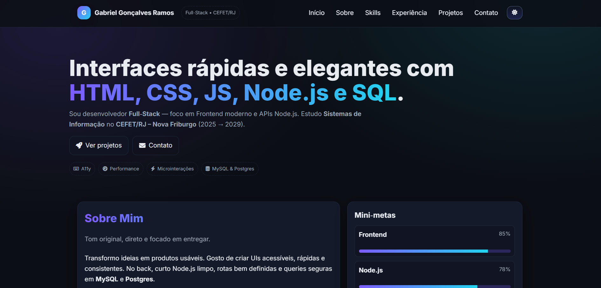

# Portfolio

Portfólio pessoal de Gabriel Gonçalves Ramos — Desenvolvedor Full-Stack.

## 🔗 Acesse o site
**[https://gogzzzs.github.io/Portfolio/](https://gogzzzs.github.io/Portfolio/)**

## 📝 Descrição
Site pessoal/portfólio com informações sobre mim, skills, experiência, projetos e formas de contato. Interface moderna, responsiva e com suporte a tema claro/escuro.

## 🚀 Funcionalidades
- Design responsivo para todos os dispositivos
- Tema claro e escuro (salvo no localStorage)
- Seção de projetos com imagens e links para demos
- Timeline de experiência
- Cards de contato com links para GitHub, LinkedIn e WhatsApp
- Animações suaves e microinterações

## 🛠️ Tecnologias
- HTML5 semântico
- CSS3 com variáveis customizadas
- JavaScript vanilla (ES6+)
- Font Awesome para ícones
- Google Fonts (Inter)

## 📂 Estrutura
- `index.html` — página principal
- `style.css` — estilos globais
- `script.js` — lógica e interatividade
- `img/` — imagens dos projetos

## 📧 Contato
- **GitHub:** [Gogzzzs](https://github.com/Gogzzzs)
- **LinkedIn:** [Gabriel Ramos](https://www.linkedin.com/in/gabriel-ramos-1a7a63382/)
- **WhatsApp:** +55 (22) 99712-4650

---

Feito com 💜 por Gabriel Gonçalves Ramos
